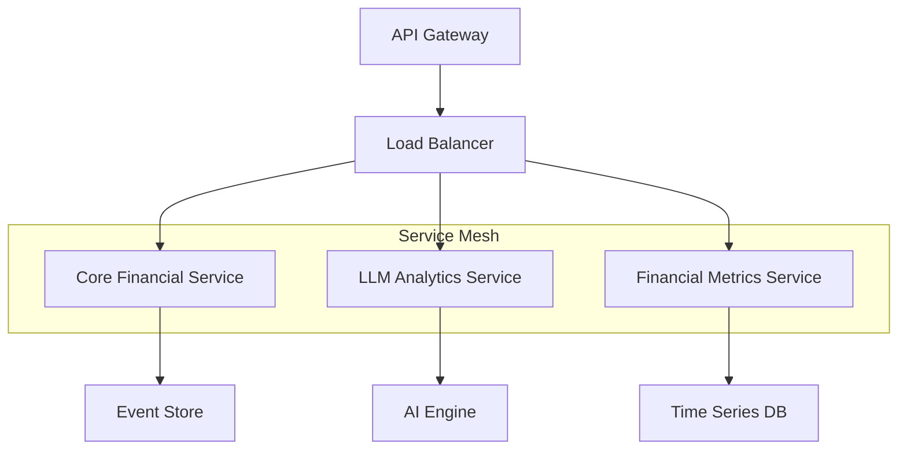
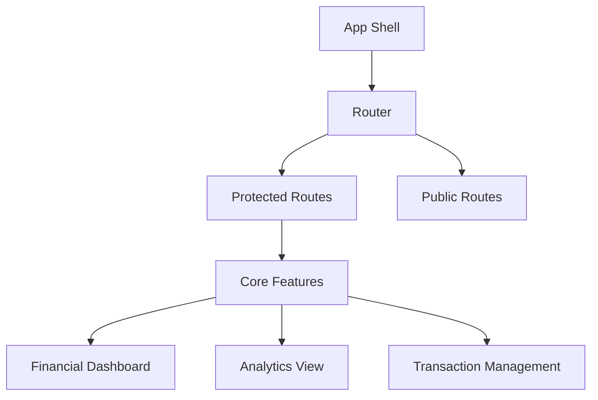

# AllFunds_AG

# 🌟 AllFunds - Financial Funds Management Platform


## 🏗️ System Architecture

AllFunds implements a scalable microservices architecture :

### Core Financial Service
- CQRS pattern for optimal read/write operations
- Domain-driven design with clear bounded contexts
- Asynchronous event handling for transaction processing

### 🤖 LLM Analytics Service
- Google Gemini AI integration for predictive analytics
- Natural Language Processing for transaction categorization
- Sentiment analysis for market insights
- Real-time financial advisory pipeline

### 📊 Financial Metrics Service
- Time-series analysis for financial projections
- Monte Carlo simulations for risk assessment
- Statistical modeling for revenue forecasting
- Technical analysis indicators generation

## 💫 Distributed System Features

### Backend Infrastructure
- **API Gateway Layer**
  - Request routing and load balancing
  - Circuit breaker implementation
  - Rate limiting and throttling
  - API versioning support

- **Service Mesh**
  - Inter-service communication
  - Service discovery
  - Distributed tracing
  - Fault tolerance

- **Data Layer**
  - Event sourcing for transaction history
  - CQRS for optimized read/write operations
  - Cache invalidation strategies
  - Data consistency patterns

### Frontend Architecture
- **Component Architecture**
  - Atomic design methodology
  - State management patterns
  - HOC implementations
  - Custom hooks library

- **Performance Optimizations**
  - Code splitting
  - Lazy loading
  - Memoization strategies
  - Virtual scrolling for large datasets

## 🔧 Technical Stack Deep Dive

### Backend Infrastructure


### Domain Services
- **Core Financial Service**
  - FastAPI for high-throughput API endpoints
  - Domain-driven design patterns
  - Event sourcing implementation
  - CQRS for scalable reads/writes

- **LLM Analytics Service**
  - Google Gemini AI integration
  - Async processing pipeline
  - Predictive modeling engine
  - NLP for transaction analysis

- **Financial Metrics Service**
  - Time series analysis engine
  - Statistical modeling framework
  - Technical analysis library
  - Real-time metrics calculation

### Frontend Architecture


## 🛠️ Development Environment

1. Clone the repository:
```bash
git clone https://github.com/your-username/allfunds.git
cd allfunds
```

2. Configure environment:
```bash
# LLM service configuration
echo 'GEMINI_API_KEY=<YOUR_API_KEY>' > backend/app/llm_microservice/.env
```

3. Launch service mesh:
```bash
docker-compose up
```

## 📡 Service Communication

### Financial Core (`:8000`)
```http
POST   /api/v1/transactions     # Process financial transaction
GET    /api/v1/ledger          # Retrieve ledger entries
PATCH  /api/v1/balance         # Update account balance
```

### LLM Analytics (`:8001`)
```http
POST   /api/v1/analyze         # Generate financial insights
GET    /api/v1/predictions     # Retrieve market predictions
```

### Metrics Engine (`:8002`)
```http
GET    /api/v1/metrics         # Fetch financial metrics
GET    /api/v1/forecasts       # Get revenue projections
```

## ⚡ Performance Metrics

- API response time: < 100ms
- Event processing latency: < 50ms
- Stream processing throughput: 1000 events/sec
- Frontend Time to Interactive: < 1.5s

## 🔒 Security Implementation

- OAuth2 with JWT tokens
- Role-based access control
- Multi-factor authentication
- Rate limiting per client

## 🧪 Testing Strategy

```bash
# Integration tests
cd backend && pytest --integration

# Load tests
k6 run load-tests/scenarios.js

# E2E tests
cypress run --spec "cypress/e2e/**/*.spec.js"
```

## 📈 Scaling Strategy

- Horizontal scaling via Docker Swarm
- Redis for distributed caching
- Message queues for async operations
- Database sharding for high throughput

## 📝 License

This project is licensed under the MIT License - see the [LICENSE](LICENSE) file for details.

---

Engineered for enterprise-grade financial operations
---

## **Contact Info**
- **Project Author:** Adir Gelkop
- **Email:** [adirgelkop@gmail.com](mailto:adirgelkop@gmail.com)
- **GitHub:** [Adir Gelkop](https://github.com/AdirGelkop)

