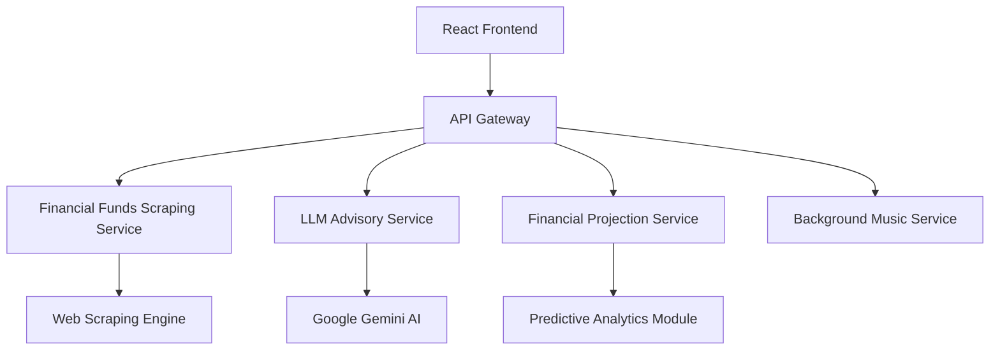

# 🚀 AllFunds: Democratizing Financial Intelligence

## 💡 Origin Story: From Confusion to Clarity

In the labyrinthine world of financial investments, I found myself lost—confronted by a bewildering array of investment vehicles: pension funds, study funds, savings plans, each with its cryptic terminology and complex performance metrics. This personal struggle became the crucible for AllFunds—a platform designed to transform financial opacity into transparent, actionable intelligence.

## 🌐 Project Overview

AllFunds is a cutting-edge microservices-based financial intelligence platform that leverages modern software engineering practices to demystify investment products. By combining web scraping, AI-powered analysis, and intuitive visualization, we enable investors to make data-driven decisions with unprecedented clarity.

## 🏗️ Architectural Diagram



## 🛠️ Technological Arsenal

### Frontend Ecosystem
- **React 18**: Declarative UI framework
- **Framer Motion**: Sophisticated animation library
- **Tailwind CSS**: Utility-first styling
- **Axios**: Promise-based HTTP client
- **React Router**: Declarative routing
- **Jest & React Testing Library**: Comprehensive testing

### Backend Frameworks
- **FastAPI**: High-performance Python web framework
- **Pydantic**: Data validation and settings management
- **BeautifulSoup4**: HTML parsing and web scraping
- **SQLAlchemy**: ORM and database toolkit
- **Uvicorn**: ASGI server implementation

### AI & Intelligence
- **Google Gemini 1.5 Flash**: Multimodal AI model
- **Natural Language Processing**: Context-aware financial analysis
- **Machine Learning**: Predictive financial modeling

### Infrastructure & Deployment
- **Docker**: Containerization
- **Docker Compose**: Multi-container orchestration
- **GitHub Actions**: CI/CD pipelines
- **Nginx**: Reverse proxy and load balancing

## 🐳 Container Topology

| Service       | Container Name | Internal Port | External Port | Purpose                          |
|---------------|----------------|--------------|--------------|----------------------------------|
| Frontend      | frontend       | 3000         | 3000         | React Application                |
| Backend       | backend        | 8000         | 8000         | FastAPI Services                 |
| LLM Service   | llm_service    | 8001         | 8001         | AI-Powered Financial Advisory    |

## 🌟 Microservices Endpoints

### Funds Service (`:8000/funds`)
- `GET /`: Retrieve all funds
- `GET /product`: Get funds by specific product type
- `GET /{index}`: Fetch specific fund details
- `GET /filter/`: Advanced fund filtering

### Advisory Service (`:8000/advisor`)
- `POST /get-advice/`: AI-powered financial consultation
- `GET /disclaimer`: Regulatory information

## ✨ Key Features

1. **Comprehensive Fund Tracking**
   - Multi-product support (Study Funds, Pension Plans)
   - Real-time performance metrics
   - Historical data analysis

2. **AI-Powered Financial Advisory**
   - Personalized investment insights
   - Hebrew-language support
   - Risk assessment and recommendations

3. **Dynamic Data Visualization**
   - Interactive financial graphs
   - Comparative fund performance
   - Predictive financial modeling

## 📸 Screenshots

> 📍 **Screenshot Placement Guidelines**:
> 1. Homepage overview
> 2. Fund comparison interface
> 3. AI advisor interaction
> 4. Financial projection visualizations
>
> **Recommended Format**:
> - Use high-contrast, clean screenshots
> - Include annotations highlighting key features
> - Ensure consistent sizing and styling

## 🎥 Demo Video

> 📍 **Video Showcase Sections**:
> 1. Platform walkthrough
> 2. AI advisor demonstration
> 3. Fund comparison tutorial
> 4. Performance projection exploration

## 📂 Project Structure

```
AllFunds_AG/
│
├── backend/               # Backend microservice
│   ├── app/
│   │   ├── api/           # API route definitions
│   │   ├── config/        # Configuration management
│   │   ├── services/      # Core business logic
│   │   └── main.py        # Application entry point
│
├── frontend/              # React application
│   ├── src/
│   │   ├── components/    # Reusable UI components
│   │   ├── pages/         # Route-specific pages
│   │   └── services/      # API interaction logic
│
└── llm_service/           # AI advisory microservice
```

## 🚀 Project Setup

### 🔑 Environment Configuration
1. Create a `.env` file in the project root
2. Add required environment variables:
   ```bash
   GEMINI_API_KEY=your_google_gemini_api_key
   DATABASE_URL=your_database_connection_string
   ```

### 🛠️ Prerequisites
- Docker Desktop (24.0+)
- Python 3.10+
- Node.js 18+
- Git

### 🐳 Deployment Steps
```bash
# Clone the repository
git clone https://github.com/EASS-HIT-PART-A-2024-CLASS-VI/AllFunds_AG.git

# Navigate to project directory
cd AllFunds_AG

# Ensure .env is configured
# Launch all services
docker-compose up --build
```

### 🌐 Accessing the Application
- Frontend: `http://localhost:3000`
- Backend API: `http://localhost:8000`
- Swagger Docs: `http://localhost:8000/docs`

## 🔒 Security Considerations

- **API Key Management**: 
  - Stored in encrypted `.env`
  - Gitignored to prevent exposure
- **CORS Configuration**: 
  - Strict origin policies
  - Token-based authentication
- **Input Validation**: 
  - Pydantic schema validation
  - Comprehensive error handling

## 🧪 Testing Strategy
- Unit Testing
- Integration Testing
- API Endpoint Verification
- Frontend Component Testing

## 👤 About the Creator

**Adir Gelkop**
- 📧 Email: adirgelkop@gmail.com
- 🔗 GitHub: [@AdirGelkop](https://github.com/AdirGelkop)
- 💼 Software Engineer | Financial Technology Enthusiast

---

**Crafted with 💖 & ☕ by a developer who believes in making finance accessible**