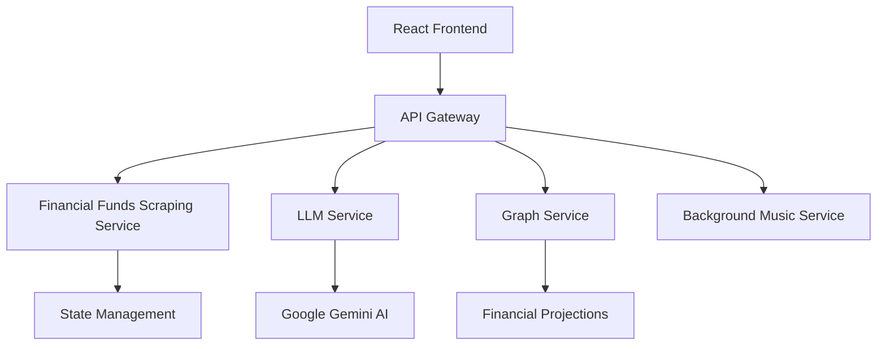

# AllFunds_AG - WIP !!

# 🌟 AllFunds - Microservices Financial Funds Management Platform


A modern financial funds management platform built on microservices architecture, featuring AI-powered insights and real-time analytics.

## 🏗️ Architecture Overview



### Microservices Structure
- **Financial Funds Scraping**: FastAPI-based main service for scraping funds performances in Israel.
- **LLM Service**: AI-powered (Gemini 1.5 flash) financial analysis using Google Gemini API.
- **Graph Service**: Financial retrospective projections and data visualization.
- **Background Music Service**: React-based service for background music, allowing users to play & pause.


## 🚀 Key Features

### Funds Service
- Investment fund tracking and monitoring
- Multiple product type support (קרנות השתלמות, קופות גמל, etc.)
- Performance metrics tracking
- Flexible fund filtering and search
- Real-time data scraping from financial sources

### LLM Advisory Service
- AI-powered financial advice using Google Gemini
- Hebrew-language investment insights
- Educational investment guidance
- Professional financial advisory responses
- Automated disclaimer handling

### Data Collection Service
- Automated web scraping system
- Real-time fund performance tracking
- Historical performance metrics
- Multi-timeframe analysis (monthly, yearly, 3-year, 5-year)

## 🛠️ Technical Stack

### Backend Services
- **FastAPI**: High-performance API framework
- **Pydantic**: Data validation and settings management
- **BeautifulSoup4**: Data scraping and parsing
- **Google Gemini AI**: LLM integration
- **Uvicorn**: ASGI server implementation

### Service Architecture
- Modular service structure
- CORS middleware support
- Exception handling
- RTL text support for Hebrew

## 🔧 Setup & Installation

1. Clone the repository:
```bash
git clone https://github.com/EASS-HIT-PART-A-2024-CLASS-VI/AllFunds_AG.git
cd AllFunds_AG
```

2. Configure environment:
```bash
# Add Gemini API key to environment
echo 'GEMINI_API_KEY=<YOUR_API_KEY>' > .env
```

3. Launch services:
```bash
docker-compose up
```

## 📡 Service Endpoints

### Funds Service (:8000)
GET    /funds/                    # Get all funds by product type
GET    /funds/product            # Get funds by specific URL
GET    /funds/{index}            # Get fund by index
GET    /funds/filter/            # Filter funds by company/type

### Advisory Service (:8000)
POST   /advisor/get-advice/      # Get AI-powered financial advice

### 📂 Project Structure
ALLFUNDS_AG
.
├── README.md
├── backend
│   ├── app
│   │   ├── __init__.py
│   │   ├── advisorLLM.py
│   │   ├── api
│   │   │   ├── __init__.py
│   │   │   ├── advisor.py
│   │   │   └── funds.py
│   │   ├── config
│   │   │   ├── __init__.py
│   │   │   └── settings.py
│   │   ├── main.py
│   │   ├── routes.py
│   │   └── services
│   │       ├── __init__.py
│   │       ├── fund_service.py
│   │       ├── llm_service.py
│   │       └── scraper_service.py
│   ├── dockerfile
│   └── requirements.txt
├── docker-compose.yml
└── frontend
    ├── dockerfile
    ├── package.json
    ├── public
    │   ├── bgm_v1.mp3
    │   └── index.html
    └── src
        ├── App.css
        ├── App.js
        ├── BackgroundMusic.js
        ├── EconomicAdvisor.js
        ├── FinancialProduct.js
        ├── InvestmentPrediction.js
        ├── SelfManagement.js
        ├── index.js
        └── services
            └── backend.js

9 directories, 30 files

## 🧪 Testing
The project includes comprehensive testing for both backend and frontend components.

### Backend Testing
- **Unit Tests**: Test individual components and functions
- **Integration Tests**: Test API endpoints and service interactions
- **Service Tests**: Test specific service functionality

```bash
# Run tests
pytest
# Test specific service
pytest tests/test_fund_service.py
pytest tests/test_llm_service.py'
```
### Frontend Testing
- **Component Tests**: Verify React component rendering and functionality
- **Service Tests**: Validate API service functions
- **UI Interaction Tests**: Test user interactions with components

```bash
# Run frontend tests (requires Docker)
cd frontend
docker build -f Dockerfile.test -t frontend-tests .
docker run --rm frontend-tests

# Run specific component tests
docker run --rm frontend-tests npm test -- src/components/layout/Navbar.test.js
```
Frontend tests ensure components render correctly, state management works properly, and API interactions function as expected. The Docker-based testing approach provides a consistent and isolated test environment.

## 🔒 Security
- Environment variables for API keys
- CORS configuration
- Request validation with Pydantic
- Error handling middleware
- Secure data scraping practices

## 📝 License
MIT License - see [LICENSE](LICENSE) for details.

---

Built with microservices architecture


## **Contact Info**
- **Project Author:** Adir Gelkop
- **Email:** [adirgelkop@gmail.com](mailto:adirgelkop@gmail.com)
- **GitHub:** [Adir Gelkop](https://github.com/AdirGelkop)

