#  AllFunds: Democratizing Financial Intelligence

## 💡 Where it all started ?

In this very branched and complex world of financial investments, I found myself lost—confronted by an enormous variety of investment products: Pension, Study, Savings plans... each with its cryptic, mysterious terminology and complex performance metrics. This personal struggle of mine, became the motive for "AllFunds"
A platform designed to transform financial obscurity into transparent, action-drivable intelligence - that is my wish .

## 🌐 Project Overview

AllFunds is a microservices-based financial intelligence platform that leverages modern software engineering practices to make investment products knowledge, accessible. By combining web scraping, AI-powered analysis, and intuitive visualization, we enable investors to make data-driven decisions with unprecedented clarity.

## 🏗️ Architectural High-level Diagram

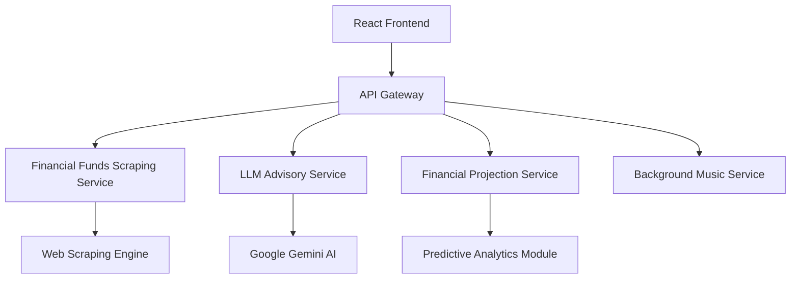

## 🛠️ Technological Stack

### Frontend Ecosystem
- **React 18**: UI framework
- **Framer Motion**: Animation library
- **Tailwind CSS**: Utility-first styling
- **Axios**: Promise-based HTTP client
- **React Router**: Declarative routing
- **Jest & React Testing Library**: Testing

### Backend Frameworks
- **FastAPI**: Python web framework
- **Pydantic**: Data validation and settings management
- **BeautifulSoup4**: HTML parsing and web scraping

### AI & Intelligence
- **Google Gemini 1.5 Flash**: Multimodal AI model
- **Natural Language Processing**: Context-aware financial analysis
- **Machine Learning**: Predictive financial modeling (could be, **will be**, better, for future and not past predictions)

### Infrastructure & Deployment
- **Docker**: Containerization
- **Docker Compose**: Multi-container orchestration
- **GitHub Actions**: Version Control Workflow

## 🐳 Container Topology

| Service       | Container Name | Internal Port | External Port | Purpose                          |
|---------------|----------------|--------------|--------------|----------------------------------|
| Frontend      | frontend       | 3000         | 3000         | React Application                |
| Backend       | backend        | 8000         | 8000         | FastAPI Services                 |
| LLM Service   | llm_service    | 8001         | 8001         | AI-Powered Financial Advisory    |

## 🌟 Microservices Endpoints

### Funds Service (`:8000/funds`)
- `GET /`: Retrieve all funds
- `GET /product`: Get funds by specific product type
- `GET /{index}`: Fetch specific fund details
- `GET /filter/`: Advanced fund filtering
- `GET /categories`: List available fund categories
- `GET /performance`: Historical performance data

### Advisory Service (`:8000/advisor`)
- `POST /get-advice/`: AI-powered financial consultation
- `GET /disclaimer`: Regulatory information

### Background Music Service (`:8001/music`)
- `POST /play`: Start background music
- `POST /pause`: Pause current track


## ✨ Key Features

1. **Comprehensive Fund Tracking**
   - Multi-product support (Study Funds, Pension Plans, etc')
   - Real-time performance metrics
   - Historical data analysis (Up to 5 years back)

2. **AI-Powered Financial Advisory**
   - Personalized investment insights
   - Hebrew-language support (Parsing process)
   - Risk assessment and recommendations

3. **Dynamic Data Visualization**
   - Interactive financial graphs
   - Comparative fund performance
   - Retrospective predictive financial modeling

## 📸 Screenshots

> 1. Homepage overview


> 2. List of all funds by type, and their yield over last month / 1/3/5 years

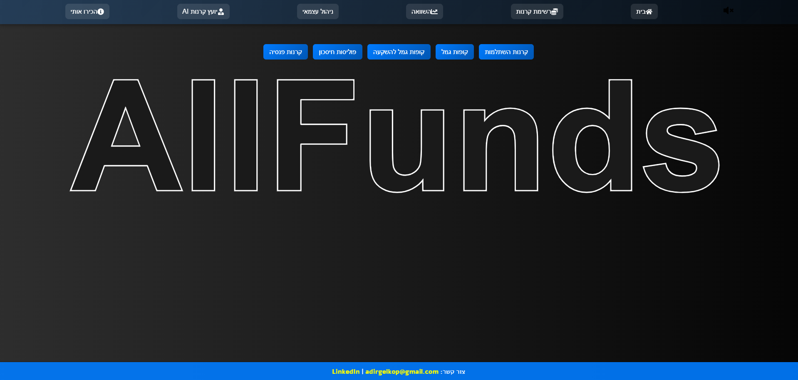
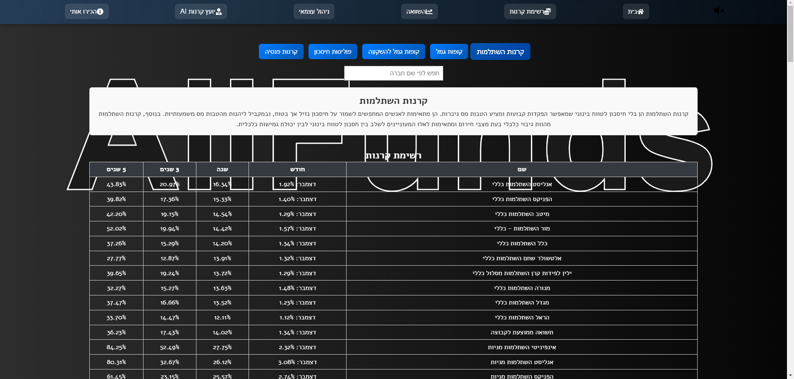
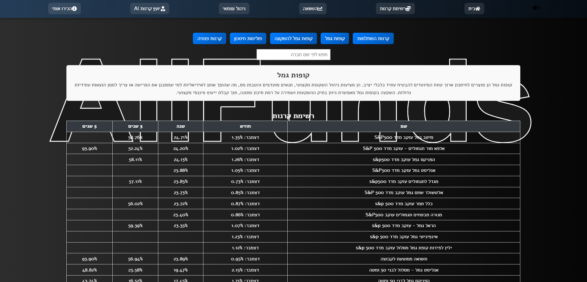
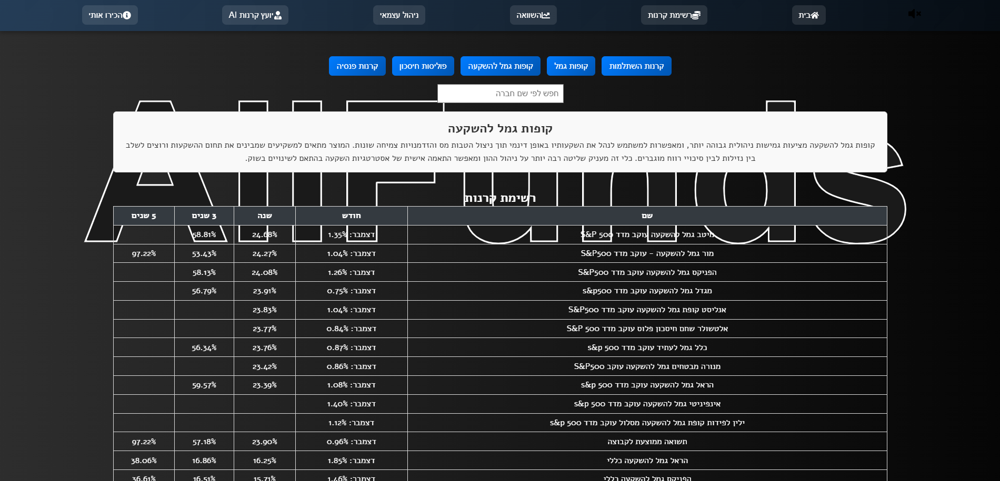
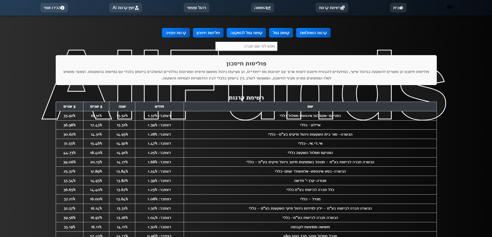
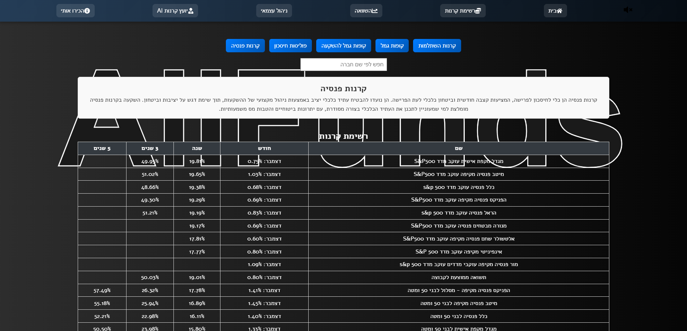

> 3. Fund comparison interface

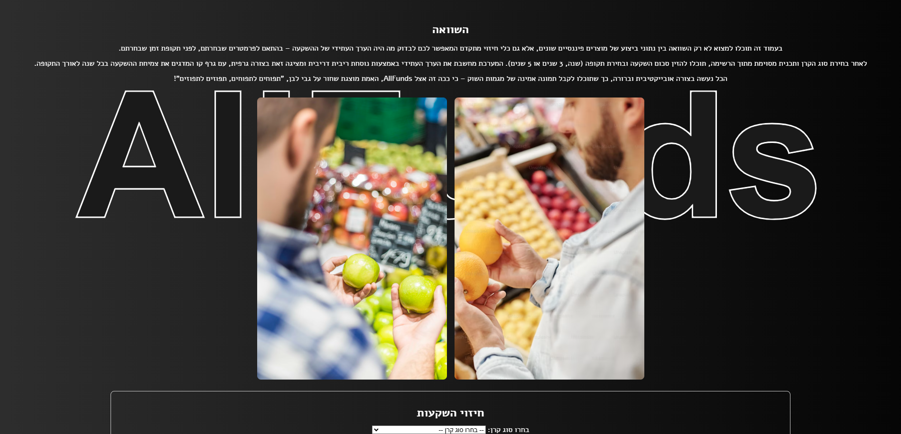
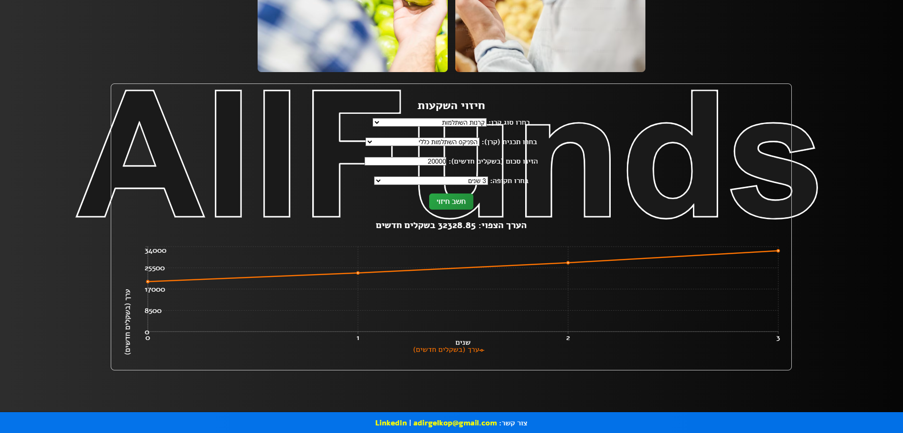
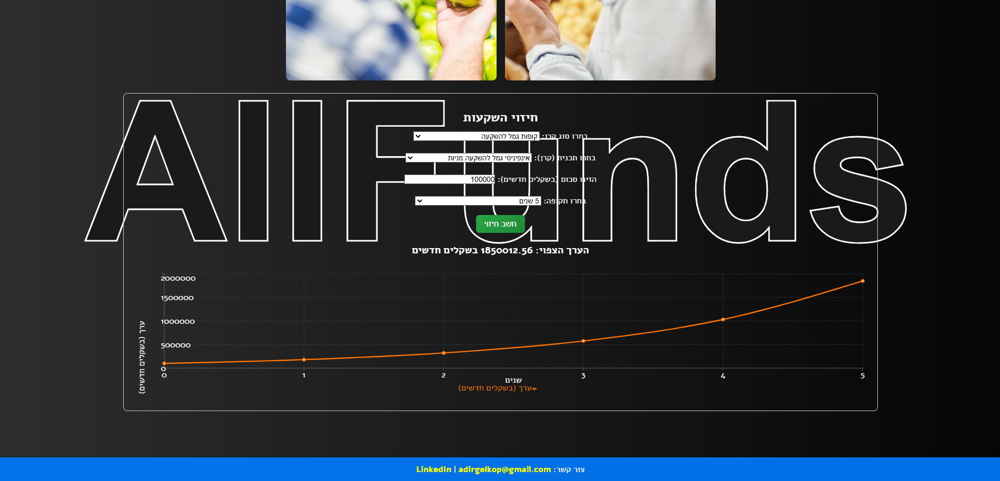

> 4. Self-Management

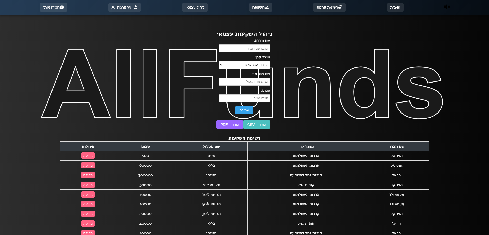
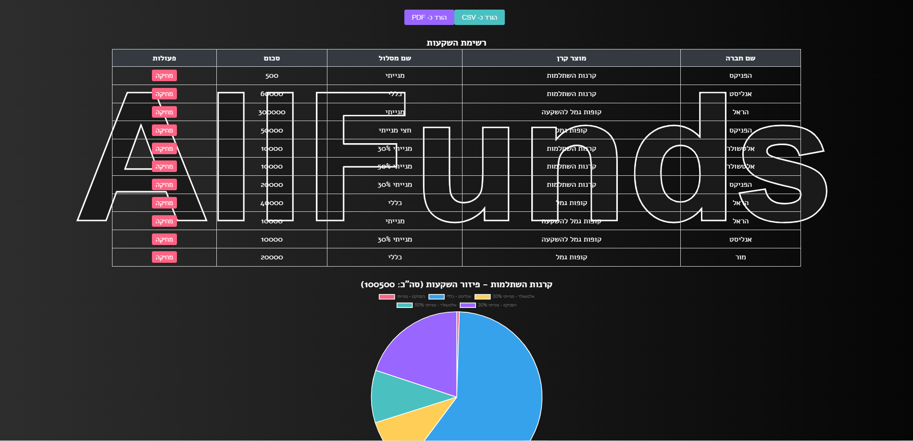
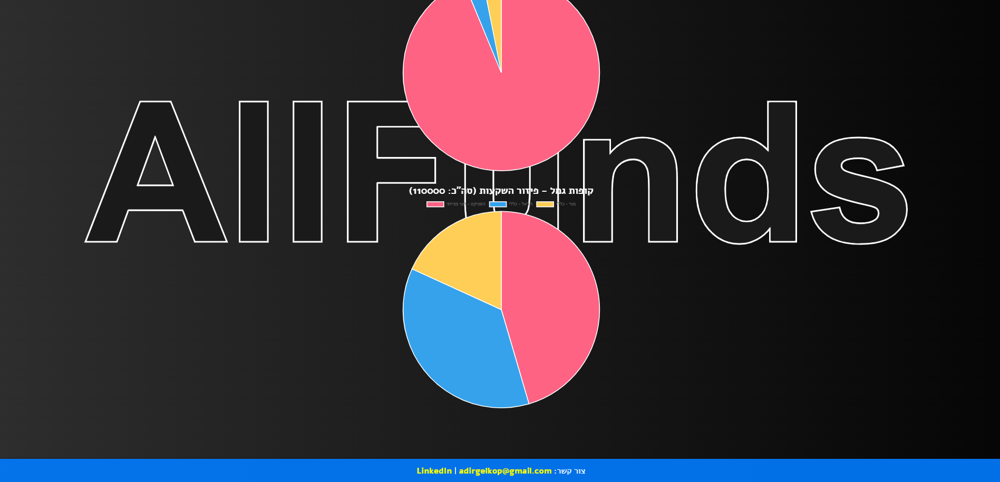

> 5. AI advisor interaction

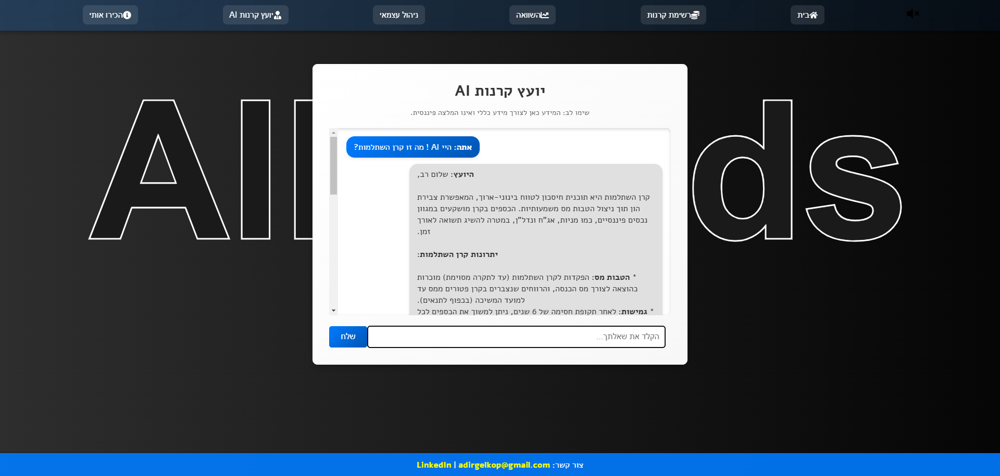

> 6. AboutMe Section

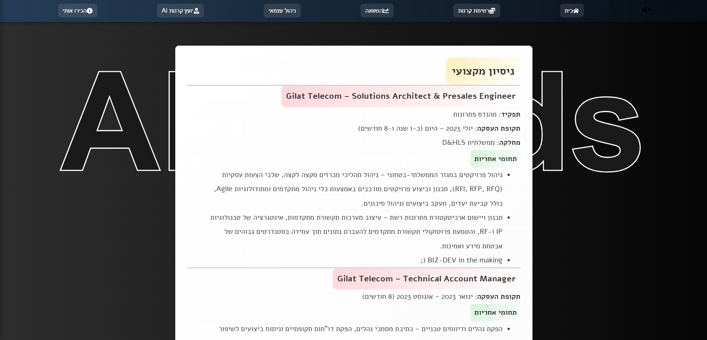
>

## 🎥 Demo Video - WIP !

> 📍 **Video Showcase Sections**:
> 1. Platform walkthrough
> 2. AI advisor demonstration
> 3. Fund comparison tutorial
> 4. Performance projection exploration

## 📂 Project Structure

```
AllFunds_AG/
│
├── backend/               # Backend microservice
│   ├── app/
│   │   ├── api/           # API route definitions
│   │   ├── config/        # Configuration management
│   │   ├── services/      # Core business logic
│   │   └── main.py        # Application entry point
│
├── frontend/              # React application
│   ├── src/
│   │   ├── components/    # Reusable UI components
│   │   ├── pages/         # Route-specific pages
│   │   └── services/      # API interaction logic
│
└── llm_service/           # AI advisory microservice
```

## 🚀 Project Setup

### 🔑 Environment Configuration
1. Create a `.env` file in the project root
2. Add required environment variables:
   ```bash
   GEMINI_API_KEY=your_google_gemini_api_key
   ```

### 🛠️ Prerequisites
- Docker Desktop (24.0+)
- Python 3.9+
- Node.js 18+
- Git

### 🐳 Deployment Steps
```bash
# Clone the repository
git clone https://github.com/EASS-HIT-PART-A-2024-CLASS-VI/AllFunds_AG.git

# Navigate to project directory
cd AllFunds_AG

# Ensure .env is configured
# Launch all services
docker compose up --build
```

### 🌐 Accessing the Application
- Frontend: `http://localhost:3000`
- Backend API: `http://localhost:8000`
- Swagger Docs: `http://localhost:8000/docs`

### 🧪 Testing Strategy
- Unit Testing
- Integration Testing
- API Endpoint Verification
- Frontend Component Testing

## Backend Testing
Test Categories

- Unit Tests: Validate individual components and functions
- Integration Tests: Verify API endpoints and service interactions
- Service-Specific Tests: Ensure targeted service functionality

Execution Commands
```bash
# Run all backend tests
pytest

# Test specific services
pytest tests/test_fund_service.py
pytest tests/test_llm_service.py
```

## Frontend Testing
Test Types

- Component Tests: Validate React component rendering
- Service Tests: Verify API service interactions
- UI Interaction Tests: Check user interface behaviors

Docker-Based Testing
```bash
# Run comprehensive frontend tests
cd frontend
docker build -f Dockerfile.test -t frontend-tests .
docker run --rm frontend-tests

# Test specific components
docker run --rm frontend-tests npm test -- src/components/layout/Navbar.test.js
```

## 🔒 Security Considerations

- **API Key Management**: 
  - Stored in encrypted `.env`
  - Gitignored to prevent exposure
- **CORS Configuration**: 
  - Strict origin policies
  - Token-based authentication
- **Input Validation**: 
  - Pydantic schema validation
  - Error handling

## 👤 About the Creator

**Adir Gelkop**
- 📧 Email: adirgelkop@gmail.com
- 🔗 GitHub: [@AdirGelkop](https://github.com/AdirGelkop)
- 💼 Solutions Engineer | FinTech Enthusiast (one might say...)

---

**Crafted with [💖 & lots of ☕] by a developer who believes in making finance accessible**